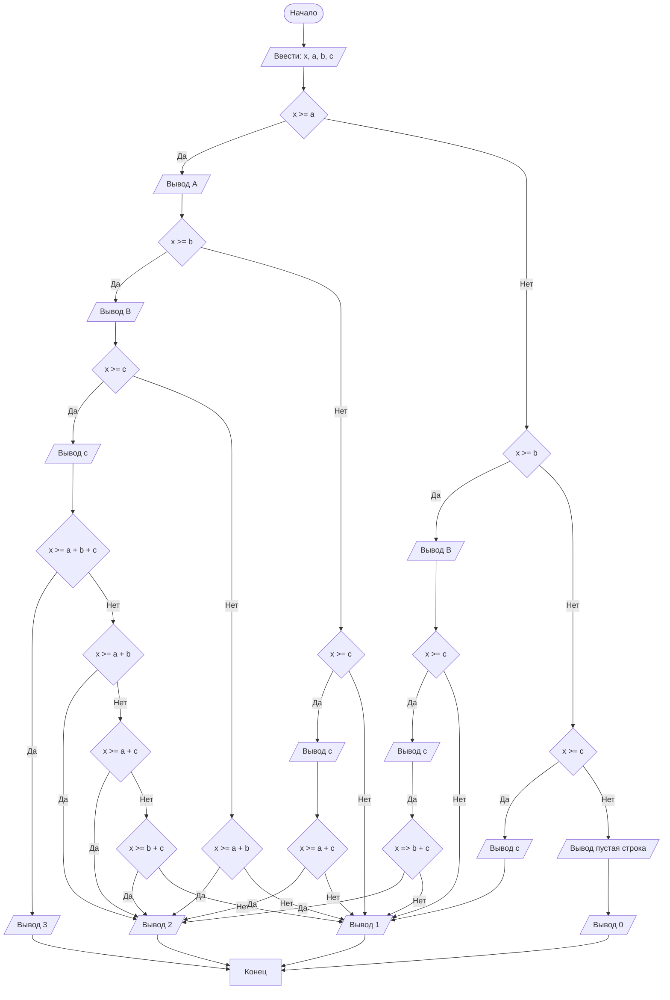

## Отчет по лабораторной работе № 1

#### № группы: `ПМ-2501`

#### Выполнил: `Разукрантов Александр Евгеньевич`

#### Вариант: `18`

### Cодержание:

- [Постановка задачи](#1-постановка-задачи)
- [Входные и выходные данные](#2-входные-и-выходные-данные)
- [Выбор структуры данных](#3-выбор-структуры-данных)
- [Алгоритм](#4-алгоритм)
- [Программа](#5-программа)
- [Анализ правильности решения](#6-анализ-правильности-решения)

### 1. Постановка задачи

> Программа получает на вход 4 числа X, A, B и C. Нужно проверить какие А, В и С меньше Х, а также
> найти максимальное количество элементов А,В и С которое можно поместитть в Х

Данную задачу можно разделить на 3 подзадачи:  Нужно проверить какие А, В и С меньше Х, осортировать А,В и С, найти суммы А,В и С меньшее Х.

- Для 1 подзадачи нужно рассмотреть 3 случая:
    1. `X >= А` (Поподает ли груз А в лифт)
    2. `X >= В` (Поподает ли груз В в лифт)
    3. `X >= С` (Поподает ли груз С в лифт)
- Для 2 подзадачи нужно отсортировать А,В и С по возрастанию:
    1. `А >= В`
    2. `В >= C` (Если А >= В то А >= В >= C)
    3. `A >= C` (Если B >= C то B >= A >= C)
    4. 

Всего надо рассмотреть `2 * 2 = 4` случая.

### 2. Входные и выходные данные

#### Данные на вход

На вход программа должна получать 4 числа, при этом в условии не сказано, к какому множеству
принадлежать получаемые числа, поэтому будем считать их вещественными. Также даны верхняя и нижняя границы получаемых
чисел.

|             | Тип                       | min значение    | max значение   |
|-------------|---------------------------|-----------------|----------------|
| X (Число 1) | Целое положительное число |       1         | 10<sup>9</sup> |
| A (Число 2) | Целое положительное число |       1         | 10<sup>9</sup> |
| B (Число 2) | Целое положительное число |       1         | 10<sup>9</sup> |
| C (Число 2) | Целое положительное число |       1         | 10<sup>9</sup> |

#### Данные на выход

Т.к. программа должна вывести модуль максимального из получаемых чисел, то на выход мы получим
единственное вещественное неотрицательное число, не превышающее 10<sup>9</sup>.

|         | Тип                                | min значение | max значение   |
|---------|------------------------------------|--------------|----------------|
| Число 1 | Вещественное неотрицательное число | 0            | 10<sup>9</sup> |

### 3. Выбор структуры данных

Программа получает 2 вещественных числа, не превышающих по модулю 10<sup>9</sup> < 2<sup>30</sup>. Поэтому для их хранения
можно выделить 2 переменных (`x` и `y`) типа `double`.

|             | название переменной | Тип (в Java) | 
|-------------|---------------------|--------------|
| X (Число 1) | `x`                 | `double`     |
| Y (Число 2) | `y`                 | `double`     | 

Для вывода результата необязательно его хранить в отдельной переменной.

### 4. Алгоритм

#### Алгоритм выполнения программы:

1. **Ввод данных:**  
   Программа считывает два вещественных числа, обозначенные как `x` и `y`.

2. **Сравнение чисел:**  
   Программа сравнивает значения `x` и `y`. Если `x` больше или равно `y`, программа переходит к следующему шагу для
   работы с `x`. Если `y` больше, программа выполняет действия для работы с `y`.

3. **Проверка знака для выбранного числа:**
    - Если было выбрано число `x` (так как оно больше или равно `y`), проверяется, положительное оно или отрицательное.
      Если `x` положительное, оно выводится на экран. Если отрицательное, выводится его модуль (т.е. противоположное
      по знаку значение).
    - Если было выбрано число `y` (поскольку оно больше `x`), выполняется аналогичная проверка. Если `y` положительное,
      оно выводится на экран. Если отрицательное, выводится его модуль.

4. **Вывод результата:**  
   На экран выводится либо большее из чисел, либо его модуль, если это число отрицательное.

#### Блок-схема



### 5. Программа

```
import java.util.Scanner;

public class Main {

    public static Scanner scan = new Scanner(System.in);

    public static void main(String[] args) {

        int x = scan.nextInt();
        int a = scan.nextInt();
        int b = scan.nextInt();
        int c = scan.nextInt();

        if (x >= a) {
            System.out.print("A ");
            if (x >= b) {
                System.out.print("B ");
                if (x >= c) {
                    System.out.println("C");
                    if (x >= a + b + c) {
                        System.out.println("3");

                    } else {
                        if (x >= a + b) {
                            System.out.println("2");
                        } else {
                            if (x >= a + c) {
                                System.out.println("2");
                            } else {
                                if (x >= c + b) {
                                    System.out.println("2");
                                } else {
                                    System.out.println("1");
                                }
                            }
                        }
                    }


                } else {
                    System.out.println();
                    if (x >= b + a) {
                        System.out.println("2");
                    } else {
                        System.out.println("1");
                    }
                }
            } else {
                if (x >= c) {
                    System.out.println("C");
                    if (x >= c + a) {
                        System.out.println("2");
                    } else {
                        System.out.println("1");
                    }
                } else {
                    System.out.println();
                    System.out.println("1");
                }


            }
        } else {
            if (x >= b) {
                System.out.print("B ");
                if (x >= c) {
                    System.out.println("C");
                    if (x >= b + c) {
                        System.out.println("2");
                    } else {
                        System.out.println("1");
                    }
                } else {
                    System.out.println();
                    System.out.println("1");
                }
            } else {
                if (x >= c) {
                    System.out.println("C");
                    System.out.println("1");
                    } else {
                        System.out.println();
                        System.out.println("0");
                    }
                }
            }
        }
    }
```

### 6. Анализ правильности решения

Программа работает корректно на всем множестве решений с учетом ограничений.

1. Тест на `X > Y > 0`:

    - **Input**:
        ```
        5 1.3
        ```

    - **Output**:
        ```
        5
        ```

2. Тест на `X < Y < 0`:

    - **Input**:
        ```
        -4 -2.2
        ```

    - **Output**:
        ```
        2.2
        ```

3. Тест на `X < 0 < Y`:

    - **Input**:
        ```
        -4 5
        ```

    - **Output**:
        ```
        5
        ```

4. Тест на `X = 0` или `Y = 0`:

    - **Input**:
        ```
        0 -3
        ```

    - **Output**:
        ```
        3
        ```

5. Тест на ограничение задачи:

    - **Input**:
        ```
        -1000000000 1000000000
        ```
